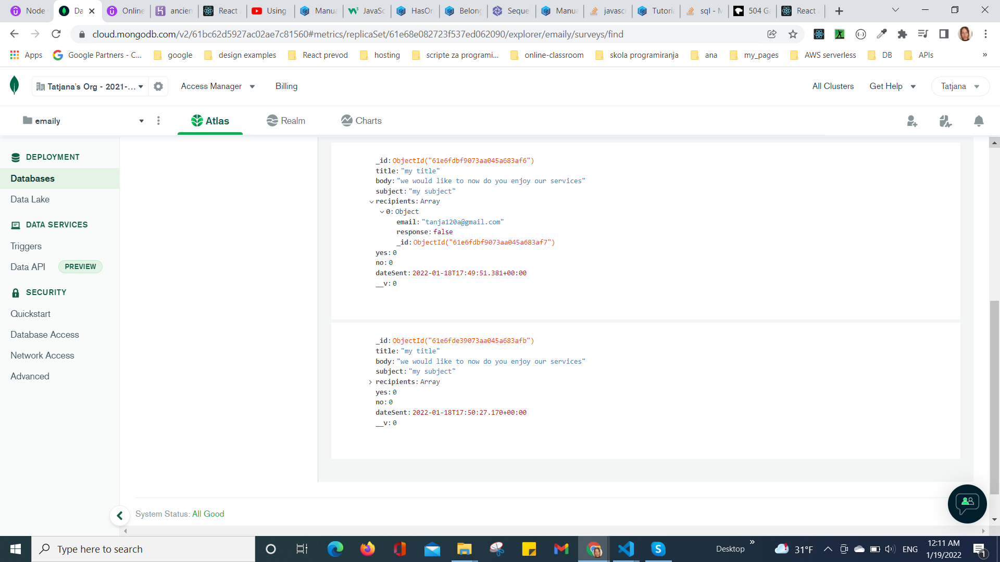

# Tatjana Marković Node-Emaily 
Full-stack Node, Express, MongoDB, React, Stripe app from Stephen Grider

## Table of contents

  - [Instruction](#instruction)
  - [Overview](#overview)
  - [Built with](#built-with)
  - [Screenshots](#screenshot)
  - [Author](#author)

## Instruction:
1. run server in development mode with at server 
    npm run dev
2. production build with
    on heroku build
        "heroku-postbuild": "NPM_CONFIG_PRODUCTION=false npm install --prefix client && npm run build --prefix client"
    build client with
        /client: npm run build
3. find it on
    http://localhost:3000

## Overview
    Emaily  is an api server that listens on port 3000 on development mode

    Front Endpoints - App.js:
    1. '/' - Landing page,
    2. '/surveys' - Dashboard,
    3. '/surveys/new' - SurveyNew, 
    
    Server Endpoints - routes:
    1. GET - '/auth/google/callback' - user login with google oauth2 - redirect to '/surveys' - Dashboard,  
    2. GET - '/auth/google/' - new user registration with google oauth2,
    3. GET - '/auth/logout' - user logout - redirect to '/' - Landing,
    4. POST - '/api/stripe' - billing with Stripe service,    
    5. POST - 'api/surveys' - new Survey, 
    6. GET - 'api/surveys/thanks' - Thank you page

    It was tested with the help of a Postman.

## Build with 
    1. Node.js
    2. Express, body-parser
    3. Cookie-session
    4. Passport
    5. Google oauth2
    6. Stripe - billing API
    7. Mongoose
    8. MongoDB
    9. React.js
    10. Redux
    11. Axios
    12. SendGrid - Email webserver (https://signup.sendgrid.com/ )

### Screenshot

## Author
- Website - [Tatjana Markovic](https://my-react-portfolio-tatjana.vercel.app/)
- LinkedIn - [Tatjana Marković](https://www.linkedin.com/in/tatjana-markovi%C4%87-919501189/)
- GitHub - [tatjama](https://github.com/tatjama)

